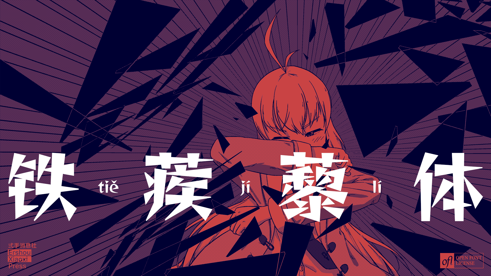
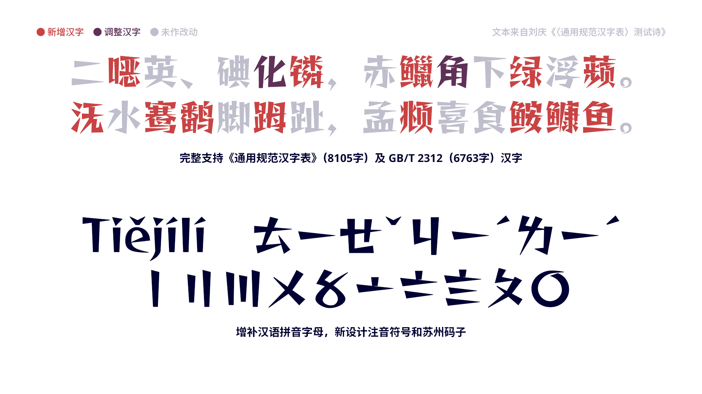
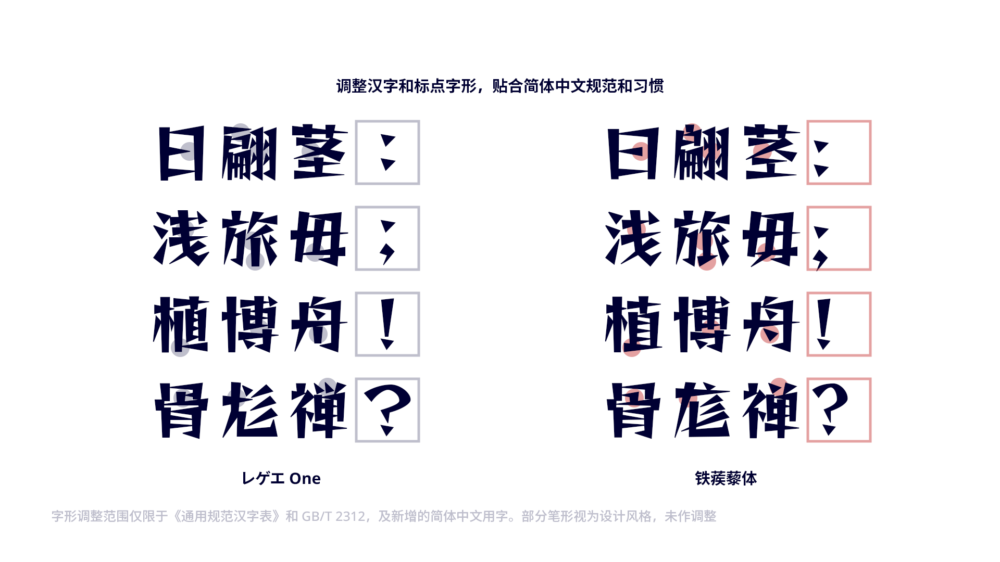
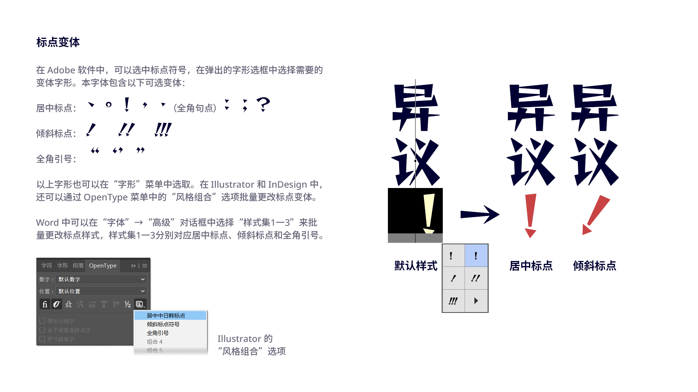
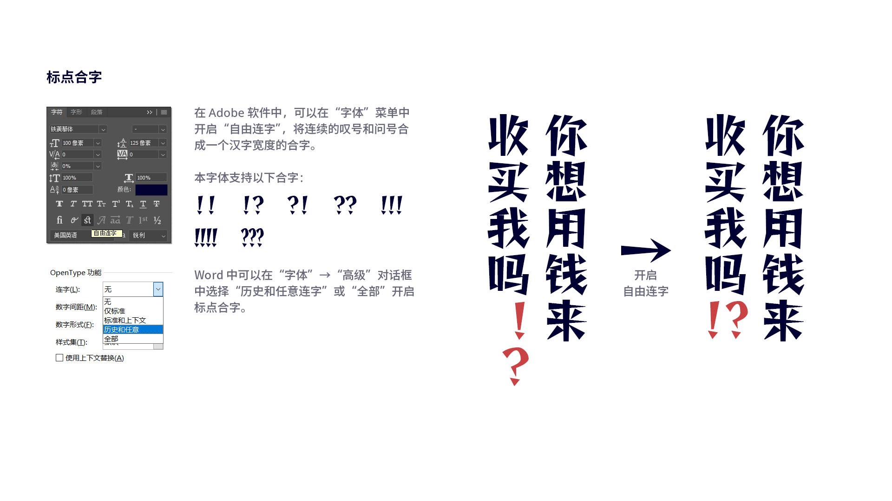
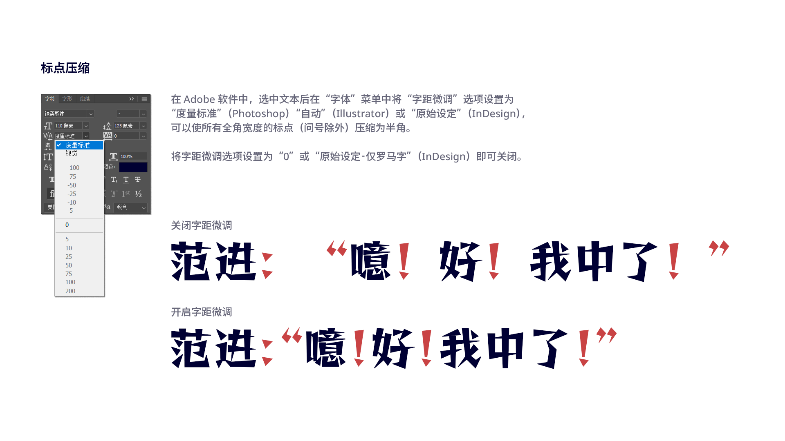
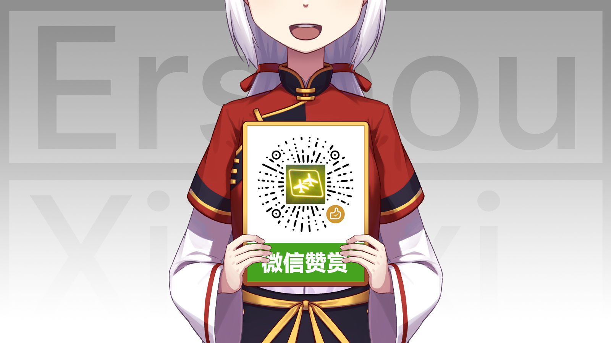

# 铁蒺藜体 Tiejili

铁蒺藜体是一款造型尖锐的美术字体，基于 Fontworks 出品的日文字体[レゲエ One](https://github.com/fontworks-fonts/Reggae) 扩充、调整字形，并添加 OpenType 特性，以满足简体中文的使用需求。

> 题图：[奈白不弍](https://www.pixiv.net/artworks/96389260)

## 特点

### 增补汉字和符号

在原版字体基础上完整支持[《通用规范汉字表》](http://www.moe.gov.cn/jyb_sjzl/ziliao/A19/201306/t20130601_186002.html)（8105字）及 [GB/T 2312](http://openstd.samr.gov.cn/bzgk/gb/newGbInfo?hcno=5664A728BD9D523DE3B99BC37AC7A2CC) 汉字（6763字），并酌情增补各专门领域常用汉字，收录字数总计超过1万，基本满足简体中文使用需求。

本字体还增补了汉语拼音字母，新设计了注音符号和苏州码子。

### 调整字形

调整部分汉字和标点字形，使其更加贴合简体中文规范和习惯。

本字体增补和调整的所有汉字请参见[《新增和调整汉字列表》](https://github.com/Buernia/Tiejili/blob/main/Documents/%E6%96%B0%E5%A2%9E%E5%92%8C%E8%B0%83%E6%95%B4%E6%B1%89%E5%AD%97%E5%88%97%E8%A1%A8.txt)。

### 排版功能
本字体支持多种 OpenType 排版特性，可以轻松实现更加精致的排版效果。

* **标点变体**

  本字体包含居中标点（`cpct`、`ss01`）、倾斜标点（`ss02`）及全角引号（`ss03`）3种可选变体。
  
  
  
* **标点合字**

  本字体支持标点合字，可以将连续的叹号和问号合成一个汉字宽度的合字。通过自选连字（`dlig`，又译 “自由连字”）开启。

  

* **标点压缩**

  本字体支持替代宽度（`halt`、`vhal`、`palt`、`vpal`）特性，可以压缩标点符号宽度。

  

## 下载

* 进入本项目的 [Releases 页面](https://github.com/Buernia/Tiejili/releases)下载。
* 进入[猫啃网](https://www.maoken.com/freefonts/15020.html)下载，同步更新。

其他网站分享的版本可能不是最新版，也不能保证同步更新。

## 授权信息

本字体以《SIL 开源字体许可证》1.1版（SIL Open Font License 1.1，OFL）授权，可以自由使用（包括商用）、传播、修改，但不能单独出售字体文件。此外，修改版本不可使用本字体的保留名称 “Tiejili” 和 “铁蒺藜”，且必须同样以《OFL》授权。详细信息请参见 https://scripts.sil.org/OFL 。

## 致谢

感谢 [ZERO子](https://github.com/Skr-ZERO)协助增补《现代汉语通用字表》汉字。

## 联系作者

* **Twitter**：[@Buernia](https://twitter.com/Buernia)
* **新浪微博**：[@奈白不弍](https://weibo.com/p/1005055835431520)
* **Email**：buernia在foxmail.com（在→@）

关于本字体的意见或问题，建议在本项目的 [Issues 页面]()提出。

## 其他项目

* [煮豆黑体 Zhudou Sans](https://github.com/Buernia/Zhudou-Sans)

## 打赏支持

**如果您喜欢本项目，欢迎通过微信打赏支持作者！**

